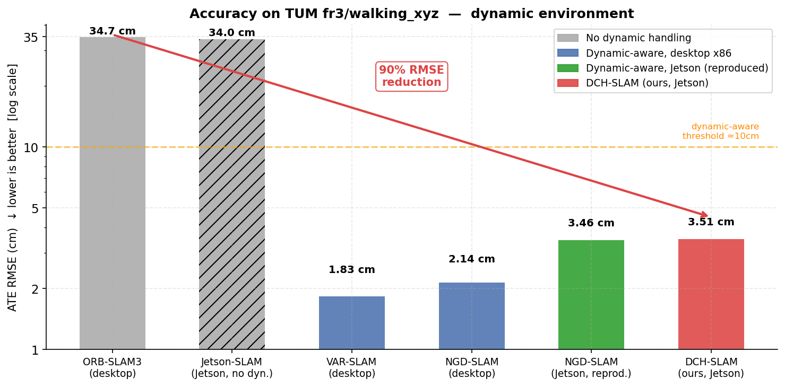
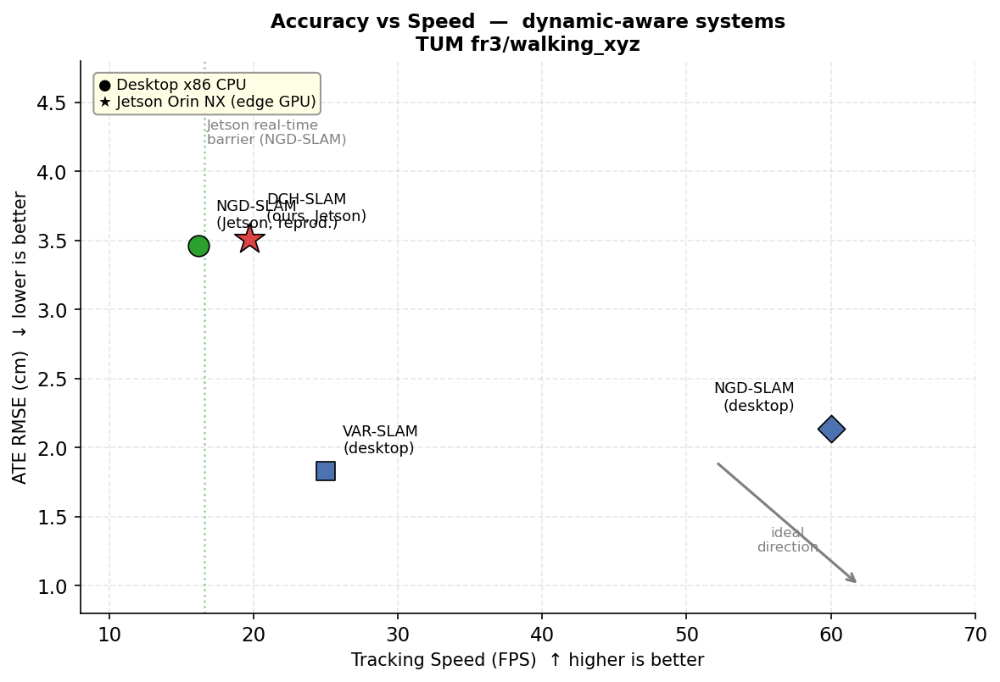
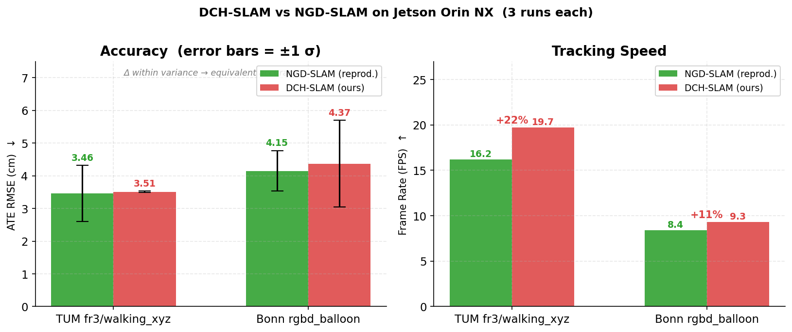
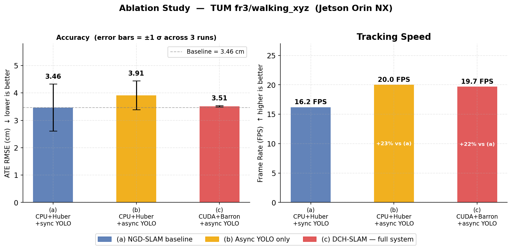

<div align="center">
  <h1>DCH-SLAM: A CUDA-Accelerated Dynamic-Aware Visual SLAM<br>for Real-Time Deployment on Edge GPUs</h1>
  <strong>ICTA 2026 (under review)</strong>
  <br>
    <a href="#" target="_blank">Dat Bui Minh Tuan</a><sup>1</sup>,
    <a href="#" target="_blank">Cuong Phan Trong</a><sup>1</sup>,
    <a href="#" target="_blank">Hung Nguyen Viet</a><sup>1</sup>,
    <a href="#" target="_blank">Mai Cao Van</a><sup>1</sup>
  <p>
    <h5>
      <sup>1</sup>FPT University, Vietnam
    </h5>
  </p>

  [](https://github.com/datrich/DCH-SLAM)
  [](#)
  [](#)

</div>

<p align="center">
  
  &nbsp;&nbsp;&nbsp;&nbsp;&nbsp;
  
</p>

**DCH-SLAM** is a visual SLAM system for dynamic environments built on top of [ORB-SLAM3](https://github.com/UZ-SLAMLab/ORB_SLAM3) and [NGD-SLAM](https://github.com/yuhaozhang7/NGD-SLAM). It unifies three lines of work:

- **CUDA-accelerated ORB front-end** — Ported from [Jetson-SLAM](https://github.com/KumarRobotics/jetson-slam): bounded rectification, pyramidal feature culling & aggregation (PyCA), and zero-copy shared-memory design for high-frame-rate feature extraction on embedded GPUs.
- **Adaptive Barron robust kernel** — Replaces the fixed Huber kernel in Local Bundle Adjustment (LBA) with an adaptive Barron kernel whose shape parameter α is estimated online from the residual distribution, down-weighting both known and unknown dynamic-object outliers.
- **Asynchronous YOLO semantic thread** — Follows the NGD-SLAM architecture: YOLO detection runs in a separate thread and is queried every *k* = 3 frames, decoupling inference latency from tracking and enabling real-time operation on edge hardware.

### Results

#### Accuracy on TUM fr3/walking_xyz (dynamic scene)

| Method | Platform | TUM RMSE ↓ | Bonn RMSE ↓ | Latency | FPS ↑ |
|--------|----------|------------|-------------|---------|-------|
| ORB-SLAM3 [1] | Desktop x86 CPU | 34.7 cm | ✗ fails | — | ~30 |
| Jetson-SLAM [2] | **Jetson Orin NX** GPU | ~34 cm* | ✗ fails | — | >60 |
| VAR-SLAM [4] | Desktop x86 CPU | 1.83 cm | — | — | ~25 |
| NGD-SLAM [3] | Desktop x86 CPU | 2.14 cm | 3.76 cm | — | ~60 |
| NGD-SLAM (reproduced) | **Jetson Orin NX** | 3.46 cm | 4.15 cm | 61.9 ms | 16.2 |
| **DCH-SLAM (ours)** | **Jetson Orin NX** | **3.51 cm** | **4.37 cm** | **50.7 ms** | **19.7** |

\* Jetson-SLAM does not handle dynamic objects; RMSE on walking sequences is comparable to ORB-SLAM3.

**Key takeaways:**
- **vs ORB-SLAM3 / Jetson-SLAM** (no dynamic handling): DCH-SLAM reduces ATE RMSE by **~90%** (34.7 → 3.51 cm) on the same Jetson hardware — dynamic-object masking is essential.
- **vs NGD-SLAM on Jetson**: DCH-SLAM achieves **+22% higher FPS** (19.7 vs 16.2) and **−18% lower latency** (50.7 vs 61.9 ms) while maintaining equivalent accuracy (Δ = 0.05 cm, within run-to-run variance).
- **First system to combine** CUDA ORB + async semantic thread + adaptive robust kernel on edge GPU: achieves near-desktop dynamic-SLAM accuracy at real-time frame rate on Jetson Orin NX.

<p align="center">
  
</p>

<p align="center">
  
</p>

<p align="center">
  
</p>

<p align="center">
  
</p>

---

# 1. Prerequisites

Tested on **Ubuntu 20.04** and **22.04**. For the CUDA front-end, an NVIDIA GPU with CUDA ≥ 11.0 is required (Jetson Orin NX uses SM87; desktop RTX uses SM89/SM120).

## C++17 Compiler
```bash
sudo apt install build-essential
```

## CUDA Toolkit
Required for the CUDA ORB front-end (`USE_CUDA_FRONTEND=ON`). Install from [developer.nvidia.com/cuda-downloads](https://developer.nvidia.com/cuda-downloads).
- Jetson Orin NX: CUDA 12.6 (via JetPack / L4T R36.5)
- Desktop: CUDA 11.8 or later

## Pangolin
Used for visualization. Download and install from [github.com/stevenlovegrove/Pangolin](https://github.com/stevenlovegrove/Pangolin).

## OpenCV ≥ 4.4
```bash
sudo apt install libopencv-dev
```

## Eigen3 ≥ 3.1
```bash
sudo apt install libeigen3-dev
```

## YOLO (included in `Thirdparty/`)
Uses the [C++ OpenCV DNN version](https://github.com/hpc203/yolov34-cpp-opencv-dnn) of [YOLO-fastest](https://github.com/dog-qiuqiu/Yolo-Fastest). Model config and weights are in `Thirdparty/YOLO/` and loaded via OpenCV (CPU backend). The semantic thread runs asynchronously every *k* frames — tracking never blocks on inference.

## DBoW2 and g2o (included in `Thirdparty/`)
Modified versions of [DBoW2](https://github.com/dorian3d/DBoW2) (place recognition) and [g2o](https://github.com/RainerKuemmerle/g2o) (nonlinear optimization). The g2o fork adds `robust_kernel_barron.h/.cpp` implementing the adaptive Barron loss.

## Python
Required for trajectory alignment with ground truth.
```bash
pip install numpy evo
```

---

# 2. Building DCH-SLAM

```bash
git clone https://github.com/datrich/DCH-SLAM.git DCH-SLAM
cd DCH-SLAM
```

Extract the ORB vocabulary:
```bash
cd Vocabulary && tar -xf ORBvoc.txt.tar.gz && cd ..
```

### CPU-only build (Barron kernel + async YOLO, no CUDA)
```bash
chmod +x build.sh
./build.sh
```

### CUDA build (Barron kernel + CUDA ORB + async YOLO)
```bash
chmod +x build.sh
USE_CUDA_FRONTEND=ON ./build.sh
```
Or manually:
```bash
mkdir build && cd build
cmake .. -DUSE_CUDA_FRONTEND=ON -DCMAKE_BUILD_TYPE=Release \
         -DCMAKE_CUDA_ARCHITECTURES="87"   # change to 89 for RTX 40xx, 120 for RTX 50xx
make -j$(nproc)
```

---

# 3. Running Examples

## TUM RGB-D Dynamic Sequences

Download from [cvg.cit.tum.de/data/datasets/rgbd-dataset](https://cvg.cit.tum.de/data/datasets/rgbd-dataset/download). Example for `freiburg3_walking_xyz`:

```bash
./Examples/RGB-D/rgbd_tum \
  ./Vocabulary/ORBvoc.txt \
  ./Examples/RGB-D/TUM3.yaml \
  /path/to/rgbd_dataset_freiburg3_walking_xyz \
  ./Examples/RGB-D/associations/fr3_walk_xyz.txt
```

## Bonn RGB-D Dynamic Dataset

Download from [www.ipb.uni-bonn.de/data/rgbd-dynamic-dataset](http://www.ipb.uni-bonn.de/data/rgbd-dynamic-dataset/). Example for the balloon sequence:

```bash
./Examples/RGB-D/rgbd_tum \
  ./Vocabulary/ORBvoc.txt \
  ./Examples/RGB-D/BonnRGBD.yaml \
  /path/to/rgbd_bonn_balloon \
  /path/to/rgbd_bonn_balloon/associations.txt
```

---

# 4. Comparison with Related Pipelines

DCH-SLAM is the first system to simultaneously address GPU-accelerated feature extraction, asynchronous semantic filtering, and adaptive robust optimization in a single ORB-SLAM3 pipeline. The table below positions it against representative recent systems:

| System | Backbone | Feature Extraction | Dynamic Handling | Semantic Thread | Robust Kernel | Edge GPU |
|--------|----------|--------------------|-----------------|----------------|---------------|----------|
| [ORB-SLAM3](https://github.com/UZ-SLAMLab/ORB_SLAM3) (TRO 2021) | ORB-SLAM3 | CPU | ✗ None | ✗ | Fixed Huber | ✗ |
| [DynaSLAM](https://github.com/BertaBescos/DynaSLAM) (RAL 2018) | ORB-SLAM2 | CPU | Hard mask (Mask R-CNN) | Sync, heavy | Fixed Huber | ✗ |
| [DS-SLAM](https://github.com/ivipsourcecode/DS-SLAM) (IROS 2018) | ORB-SLAM2 | CPU | Hard mask (SegNet) | Sync | Fixed Huber | ✗ |
| [Jetson-SLAM](https://github.com/KumarRobotics/jetson-slam) (RAL 2023) | ORB-SLAM2 | **CUDA** | ✗ None | ✗ | Fixed Huber | ✓ |
| [NGD-SLAM](https://github.com/yuhaozhang7/NGD-SLAM) (IROS 2025) | ORB-SLAM3 | CPU | Hard mask (YOLO) | **Async** | Fixed Huber | ✗ |
| [VAR-SLAM](https://arxiv.org/abs/2510.16205) (arXiv 2025) | ORB-SLAM3 | CPU | Soft weight (YOLO) | Sync | **Adaptive Barron** | ✗ |
| **DCH-SLAM** (ours) | ORB-SLAM3 | **CUDA** | Soft weight (YOLO + depth) | **Async** | **Adaptive Barron** | **✓** |

**Key observations:**
- Jetson-SLAM is the only prior GPU-accelerated system but targets ORB-SLAM2 and has no dynamic handling.
- NGD-SLAM achieves async inference on CPU but uses a fixed Huber kernel, making it sensitive to unknown dynamic objects.
- VAR-SLAM introduces the adaptive kernel but runs synchronous YOLO and is CPU-only.
- DCH-SLAM is the first pipeline to combine all three: CUDA front-end + async semantic thread + adaptive robust kernel, enabling deployment on embedded GPU platforms.

---

# 5. Citation

If you find DCH-SLAM useful in your research, please cite:

```bibtex
@inproceedings{bui2026dchslam,
  title={{DCH-SLAM}: A CUDA-Accelerated Dynamic-Aware Visual SLAM for Real-Time Deployment on Edge GPUs},
  author={Bui Minh Tuan, Dat and Phan Trong, Cuong and Nguyen Viet, Hung and Cao Van, Mai},
  booktitle={Proceedings of the International Conference on Intelligent Technologies and Applications (ICTA)},
  year={2026}
}
```

DCH-SLAM builds on top of the following works — please also cite them:

```bibtex
@inproceedings{zhang2025ngdslam,
  title={{NGD-SLAM}: Towards Real-Time Dynamic SLAM without GPU},
  author={Zhang, Yuhao and Bujanca, Mihai and Luj{\'a}n, Mikel},
  booktitle={2025 IEEE/RSJ International Conference on Intelligent Robots and Systems (IROS)},
  pages={3467--3473},
  year={2025},
  doi={10.1109/IROS60139.2025.11246202}
}

@article{campos2021orbslam3,
  title={{ORB-SLAM3}: An Accurate Open-Source Library for Visual, Visual-Inertial and Multi-Map SLAM},
  author={Campos, Carlos and Elvira, Richard and Rodr{\'\i}guez, Juan J G{\'o}mez and Montiel, Jos{\'e} MM and Tard{\'o}s, Juan D},
  journal={IEEE Transactions on Robotics},
  volume={37},
  number={6},
  pages={1874--1890},
  year={2021},
  doi={10.1109/TRO.2021.3075644}
}

@article{kumar2023jetsonslam,
  title={High-Speed Stereo Visual SLAM for Low-Powered Computing Devices},
  author={Kumar, Ashish and Park, Jaehyun and Behera, Laxmidhar},
  journal={IEEE Robotics and Automation Letters},
  volume={8},
  number={2},
  pages={499--506},
  year={2023},
  doi={10.1109/LRA.2022.3228183}
}
```
